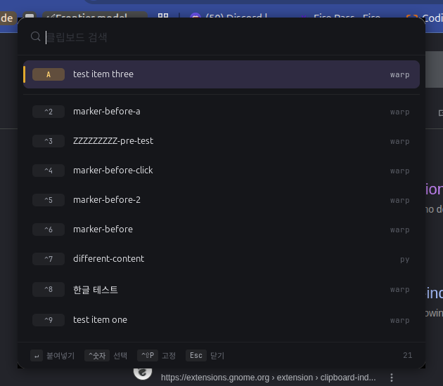

# Pastewisp

> A fast, minimal clipboard history manager for Linux.


Pastewisp gives Linux users a clean, keyboard-first clipboard history
experience. Press a shortcut, search your clipboard history, hit Enter, and get
back to work. Inspired by [Maccy](https://github.com/p0deje/Maccy) on macOS —
built from scratch for Linux desktops.

The first polished target is **Ubuntu (GNOME, X11)** with GTK 4. See
[Linux compatibility](#linux-compatibility) for what works where.



> If Pastewisp feels useful, consider starring the repo — it helps other Linux
> users discover the project.

## Features

- 🔍 **Searchable clipboard history** — SQLite FTS5, instant filtering, handles non-ASCII (CJK) substrings
- ⌨️ **Global hotkey popup** — default `Ctrl+Shift+V`, summon from anywhere
- 📍 **Pops up at your mouse cursor** — no hunting for the window
- 📎 **Auto-paste** — press Enter, the popup hides and `Ctrl+V` is synthesized into the previously focused window (XTest)
- 🔢 **Position shortcuts** — `Ctrl+1..9, Ctrl+0` to activate items 1..10
- 🔤 **Fixed alphabet shortcuts for pinned items** — each pinned item is auto-assigned a letter (`A..Z`) that stays with the item; press `Ctrl+letter` to paste it
- ⌥ **Alt mode** — hold Alt to switch shortcut badges into pin-toggle mode (`Alt+number` pins by position, `Alt+letter` unpins)
- 📌 **Pinning / favorites** — pinned items are always shown first with a gold accent
- 🖼️ **Image clipboard** — images are stored with thumbnails
- 🚫 **App exclusion** — known password managers (KeePassXC, Bitwarden, 1Password, gnome-keyring) are excluded by default
- 🔔 **System tray menu** — separate subprocess so we can use AyatanaAppIndicator (GTK 3) without conflicting with the main GTK 4 app
- 🚀 **systemd user service** — autostarts on login
- 🎨 **Refined dark UI** — Spotlight/Raycast-style aesthetic with subtle accent bars, section dividers, and proper typography

## Requirements

- Ubuntu 24.04 LTS (or compatible GNOME-based distro)
- **X11 session** — Wayland is not yet supported (`echo $XDG_SESSION_TYPE` must print `x11`; on the login screen pick "Ubuntu on Xorg")
- Python ≥ 3.11

## Install

### Option A — `.deb` (Ubuntu / Debian)

Download `pastewisp_<version>_all.deb` from the
[Releases](https://github.com/doublehS2/pastewisp/releases) page, then:

```bash
sudo apt install ./pastewisp_0.1.0_all.deb
# Enable autostart + start now (user service):
systemctl --user enable --now pastewisp
```

### Option B — from source

```bash
git clone https://github.com/doublehS2/pastewisp.git
cd pastewisp
bash scripts/install.sh
```

What the installer does:

1. Verifies required APT packages (and tells you the `sudo apt install` command if any are missing).
2. Creates a Python venv at `~/.local/share/pastewisp/venv` with `--system-site-packages` (so PyGObject is shared from the system rather than rebuilt).
3. Installs the package in editable mode.
4. Registers a systemd user unit and enables + starts it.
5. Runs `--self-check` to confirm everything is wired up.

After install, press `Ctrl+Shift+V` to summon the popup.

### Manual install

If you'd rather not use the script:

```bash
sudo apt install python3-venv python3-gi gir1.2-gtk-4.0 gir1.2-gtk-3.0 \
                 gir1.2-ayatanaappindicator3-0.1 gir1.2-atspi-2.0 xclip
python3 -m venv --system-site-packages .venv
.venv/bin/pip install -e .
.venv/bin/python -m pastewisp
```

## Usage

### Popup keybindings

| Key | Action |
|---|---|
| `Ctrl+Shift+V` (configurable) | Open the popup |
| Type | Live filter |
| `↑ / ↓` | Move selection, `PageUp/PageDown` jumps 8 |
| **Mouse click** | Activate the clicked item (single-click) |
| `Enter` | Copy + auto-paste into the previously focused window |
| `Shift+Enter` | Copy only, no auto-paste |
| **`Ctrl+1..9, Ctrl+0`** | Activate items 1..10 in the visible list |
| **`Ctrl+A..Z`** | Activate the pinned item with that letter |
| **Hold `Alt`** | Switch shortcut badges into pin-toggle mode |
| `Alt+1..9, Alt+0` | Toggle pin for items 1..10 (popup stays open) |
| `Alt+A..Z` | Unpin the pinned item with that letter |
| `Ctrl+Shift+P` | Toggle pin on the currently selected item |
| `Delete` | Delete the selected item |
| `Esc` | Close the popup |
| Click outside | Close the popup |

### Tray menu

The clipboard icon in the top bar provides:

- Open clipboard
- Preferences…
- Clear history
- Quit

### Configuration file

`~/.config/pastewisp/config.toml` — edit directly or open it from the tray's **Preferences…** entry.

```toml
[general]
history_limit = 500
hotkey = "<Control><Shift>v"
auto_paste = true
start_minimized_to_tray = true

[storage]
keep_images_days = 30
max_image_bytes = 4_194_304   # 4 MiB

[exclude]
apps = ["keepassxc", "1password", "bitwarden", "gnome-keyring"]
```

`hotkey` uses GTK accelerator syntax: `<Control>`, `<Shift>`, `<Alt>`,
`<Super>` plus a key name.

### Service management

```bash
systemctl --user status pastewisp     # check status
systemctl --user restart pastewisp    # restart
journalctl --user -u pastewisp -f     # tail the log
```

Manual start/stop:

```bash
pastewisp --quit          # ask the running instance to quit (via D-Bus)
pastewisp --self-check    # run diagnostics
pastewisp                 # run directly (foreground)
```

## Architecture

```
GtkApplication (com.xnsystems.Pastewisp, GTK 4)
├── ClipboardWatcher ──────── GDK Clipboard "changed" → HistoryManager
├── HistoryManager ────────── dedupe(SHA-256) + size cap + image expiry
├── SQLite (~/.local/share/pastewisp/db.sqlite, FTS5)
├── HotkeyListener (X11) ──── XGrabKey thread → GLib.idle_add to main
├── AutoPaster (X11) ──────── XTestFakeKeyEvent to synthesize Ctrl+V
├── ActiveWindowProbe ─────── _NET_ACTIVE_WINDOW → WM_CLASS + geometry
├── CursorProbe ───────────── mouse position via Xlib query_pointer
├── positioning.py ────────── GdkX11 XID + Xlib XConfigureWindow with retries
├── PopupWindow (GTK 4) ────── SearchEntry + ListView with single-line rows
├── PreferencesWindow (GTK 4)
└── TrayManager → pastewisp.tray_proc (subprocess, GTK 3 + AyatanaAppIndicator3)
       └── D-Bus org.freedesktop.Application.ActivateAction → main app
```

Each platform-specific backend (`hotkey`, `paster`, `active_window`) sits
behind a small Protocol so a Wayland implementation can drop in later
without touching the rest of the app.

## Uninstall

```bash
bash scripts/uninstall.sh           # disables the service, keeps config + DB
bash scripts/uninstall.sh --purge   # also removes venv, config, DB
```

## Development

```bash
.venv/bin/pytest                          # headless tests (config/db/history/hotkey)
.venv/bin/python -m pastewisp --self-check
.venv/bin/python scripts/smoke_watcher.py  # manual clipboard-watcher smoke test
```

The codebase favors small, focused modules with clear backend boundaries.
Tests live in `tests/`. CSS for the popup is a single token-driven
stylesheet in `src/pastewisp/ui/popup.py`.

## Known limitations

- **Wayland is not supported.** `XDG_SESSION_TYPE=x11` is required (XGrabKey
  and XTest are X11-only).
- The tray icon runs as a subprocess. GNOME does not show
  AppIndicator/SNI icons out of the box — install the "AppIndicator and KStatusNotifierItem Support"
  extension if you don't see the tray icon.
- Auto-paste can be blocked by sandboxed apps (some Flatpaks, Wayland
  clients running under XWayland with input restrictions). Use
  `Shift+Enter` to copy without pasting in that case.

## Privacy

Pastewisp stores clipboard history **locally** on your machine
(`~/.local/share/pastewisp/db.sqlite`). It does not upload clipboard contents
to any server, and there is no analytics or telemetry of any kind.

Clipboard history can contain sensitive data such as passwords, tokens, private
messages, and personal information. You should clear history when needed and
keep your password manager in the excluded-apps list (KeePassXC, Bitwarden,
1Password, and gnome-keyring are excluded by default). To wipe stored data, use
**Clear history** from the tray, or `bash scripts/uninstall.sh --purge`.

## Linux compatibility

Linux clipboard behavior differs across desktop environments and display
servers. Pastewisp aims to support common Linux desktop setups, but some
behavior varies between X11 and Wayland.

| Feature | X11 | Wayland |
|---|---|---|
| Clipboard capture | ✅ | ❌ (not yet) |
| Global hotkey (`XGrabKey`) | ✅ | ❌ X11-only |
| Auto-paste (`XTest` Ctrl+V) | ✅ | ❌ X11-only |
| Popup at cursor | ✅ | ❌ |

If automatic paste is unavailable or unreliable in your environment, Pastewisp
still copies the selected history item back to the clipboard so you can paste it
manually with `Shift+Enter`. Tried it on a setup not listed here? Please file a
[compatibility report](https://github.com/doublehS2/pastewisp/issues/new?template=compatibility_report.yml).

## How Pastewisp compares

Some clipboard managers are extremely powerful. Pastewisp is intentionally
smaller: fast search, a clean UI, keyboard-first usage, and local history.

| App | Best for | Tradeoff |
|---|---|---|
| [CopyQ](https://github.com/hluk/CopyQ) | Advanced clipboard workflows and scripting | More complex than some users need |
| [GPaste](https://github.com/Keruspe/GPaste) | GNOME-oriented clipboard management | UX may not feel as lightweight or modern |
| Clipboard Indicator | Simple indicator-based usage | Limited modern search workflow |
| **Pastewisp** | Fast, minimal, keyboard-first clipboard history | New project with a focused feature set; X11 only for now |

## Roadmap

Done in **v0.1.0**: text history, FTS5 search, global hotkey popup, keyboard
navigation, auto-paste, pinning, image clipboard, app exclusion, delete / clear,
preferences, tray, systemd service, `.deb` package.

Planned, in rough order:

- Wayland support (clipboard capture, hotkey, paste fallback).
- AppImage / Flatpak packaging.
- Per-app ignore list UI and regex-based ignore rules.
- Auto-delete history older than N days.
- Import/export settings.

**Non-goals:** cloud sync, team sharing, browser extensions, a scripting/
automation engine, or becoming a full CopyQ replacement. Pastewisp stays small
on purpose.

## Contributing

Issues and pull requests welcome — see [CONTRIBUTING.md](CONTRIBUTING.md) and our
[Code of Conduct](CODE_OF_CONDUCT.md). Before opening a PR:

- `.venv/bin/pytest` must pass.
- Keep CSS tokens centralized in `popup.py`'s `_CSS` block.
- Comments and UI strings should be in English.

## License

[MIT](LICENSE)

## Disclaimer

Pastewisp is inspired by [Maccy](https://github.com/p0deje/Maccy), but is **not
affiliated** with Maccy or its maintainers. Pastewisp is also **not affiliated**
with Canonical, GNOME, KDE, or any Linux distribution vendor.
